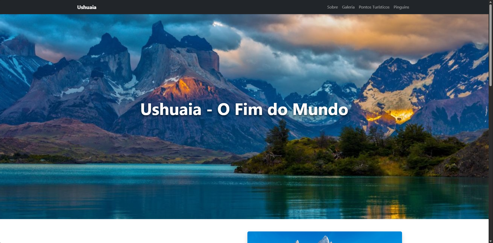

# 🏔️ [Ushuaia - Landing Page](https://uelintonhj.github.io/ushuaia-site/)

Landing page construída com foco em **HTML**, **CSS** e **Bootstrap 5**, apresentando uma interface limpa, responsiva e organizada.
O objetivo do projeto é praticar estruturação visual usando componentes do Bootstrap e boas práticas de layout moderno.

---

## 🚀 Funcionalidades

- Layout totalmente responsivo
- Estruturação construída com Bootstrap 5
- Seções organizadas em grid
- Tipografia e espaçamentos consistentes
- Estilo visual limpo e agradável
- Ideal para estudo e portfólio

---

## 🛠️ Tecnologias utilizadas

- HTML5
- CSS3
- Bootstrap 5
- Git & GitHub

---

## 📸 Preview



---

## 📦 Como executar o projeto

```
git clone https://github.com/UelintonHJ/ushuaia-site.git
cd ushuaia-site
abrir o index.html no navegador
```
Não é necessária nenhuma instalação adicional.

---

## 📚 Aprendizados
Neste projeto, pratiquei a construção de layouts utilizando o **sistema de grid do Bootstrap**, organização de seções, responsividade nativa do framework e personalização de estilos com CSS. Também reforcei conceitos de design limpo e estruturação semântica com HTML5.

---

## 🧑‍💻 Autor

**Uelinton Janke**

LinkedIn: https://www.linkedin.com/in/uelinton-janke/


